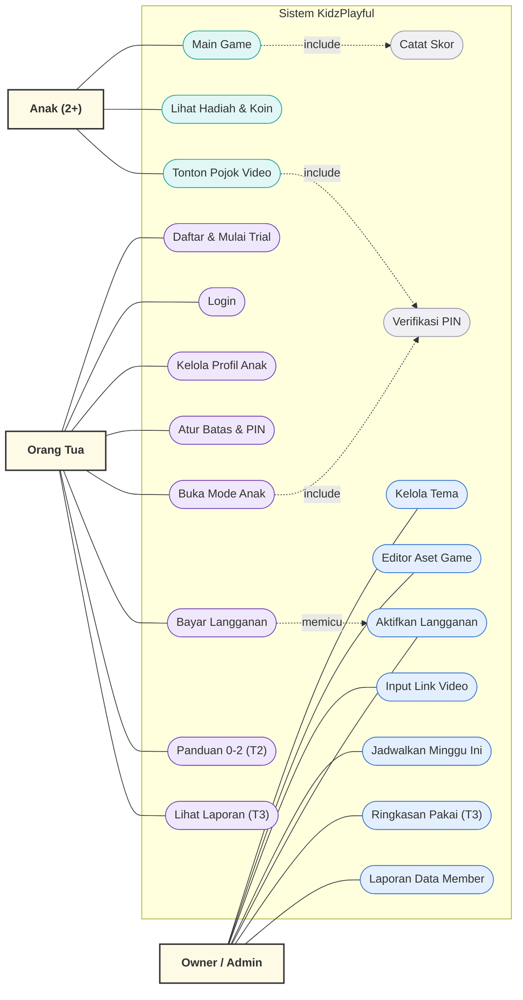
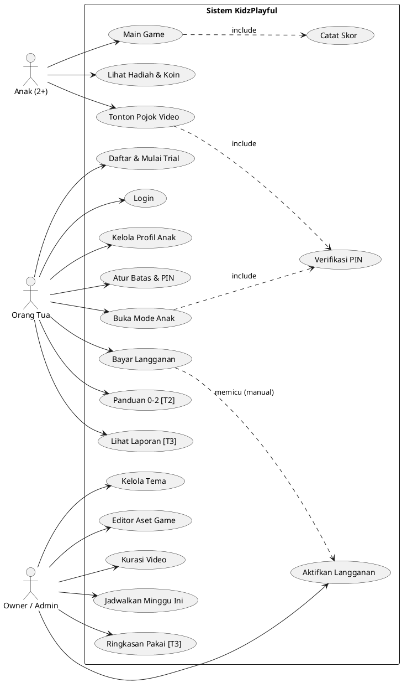
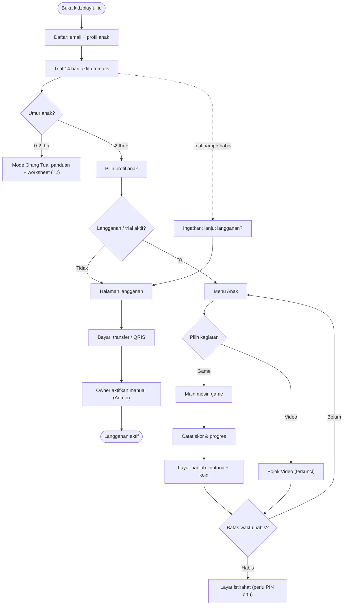
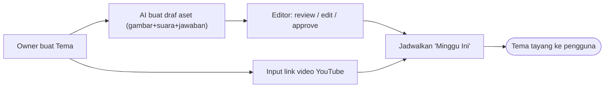
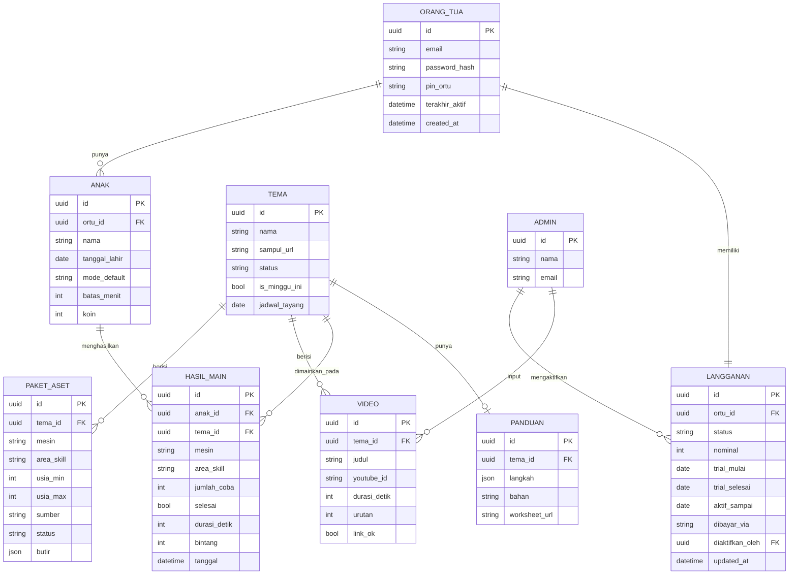

# KidzPlayful — Dokumen Desain (Spec)

- **Tanggal:** 2026-06-10
- **Status:** Disetujui untuk masuk tahap perencanaan implementasi
- **Pemilik produk:** Owner kelas bermain "kidzplayful"
- **Jenis:** Web app berlangganan untuk edukasi anak 0-4 tahun

---

## 1. Latar Belakang & Tujuan

Owner menjalankan kelas bermain **kidzplayful** untuk anak usia 1-4 tahun (tema berganti tiap
minggu, melatih sensorik, motorik, dan kemandirian). Kelas tersebut kini berhenti. Owner juga
menjual bahan mainan sensorik dan worksheet digital anak.

Tujuan produk ini: **memindahkan nilai kelas bermain ke produk digital berlangganan**, sebagai
sumber pemasukan berulang pengganti kelas, sambil tetap setia pada nilai brand (bermain melatih
sensorik-motorik) — yaitu **screen time yang terkontrol dan bermakna**, bukan layar tanpa batas.

### Paradoks yang disadari & cara mengatasinya
Brand dibangun di atas bermain fisik/hands-on, sedangkan ini produk layar untuk balita. Pedoman
WHO/IDAI menyarankan **0 screen time untuk di bawah 2 tahun** dan terbatas untuk 2-4 tahun.
Diatasi dengan **segmentasi umur**:
- **0-2 tahun → Mode Orang Tua:** layar di tangan ortu (panduan aktivitas fisik + worksheet).
- **2 tahun ke atas → Mode Anak:** game di layar dengan skor, dengan batas waktu ketat.

Satu aplikasi yang **tumbuh bersama anak** (dipakai dari bayi sampai balita) → bagus untuk retensi.

---

## 2. Keputusan Kunci (yang sudah disepakati)

| Topik | Keputusan |
|---|---|
| Pemegang layar | Segmentasi umur: 0-2 = ortu, 2+ = anak |
| Hubungan dengan kelas lama | **Campuran**: ada jalur tema mingguan + akses bebas semua konten |
| Skor | **Dua wajah**: bintang/koin untuk anak (semangat, tanpa menang-kalah) + data perkembangan untuk ortu |
| Platform | **Web app** (browser HP/tablet/laptop), bukan app native dulu |
| Monetisasi | **Langganan bulanan** + **free trial 14 hari** |
| Cara membangun | **Opsi B**: web app penuh, tapi **aktivasi langganan manual** dulu (gateway otomatis menyusul) |
| Strategi game | **Opsi 1**: beberapa "mesin game" yang diganti-tema tiap minggu (bukan game unik dari nol) |
| Produksi konten | **Mesin game = hard-code**; **konten tema = hybrid** (AI buat draf → owner review/approve) |
| Fitur tambahan | **Pojok Video**: video YouTube terkurasi & terkunci di dalam app |
| Fitur Owner tambahan | **Kelola Video** (input link YouTube) + **Laporan Data Member** (langganan, pendapatan, keterlibatan, daftar) |
| Bahasa produk & dokumen | Bahasa Indonesia |
| Nama kerja | KidzPlayful |

---

## 3. Lingkup Bertahap

Semua fitur adalah bagian dari visi penuh, tetapi dibangun bertahap agar bisa meluncur cepat dan
produksi konten tidak macet ("treadmill konten").

- **Tahap 1 (peluncuran):** Mode Anak (game + skor), Pojok Video, jalur tema mingguan + pustaka,
  langganan/trial dengan aktivasi manual, Dashboard Admin, **perekaman data skor** (untuk laporan nanti).
- **Tahap 2:** Mode Orang Tua 0-2 (panduan aktivitas + worksheet bertema).
- **Tahap 3:** Laporan Perkembangan ortu (grafik per area skill, memakai data yang sudah direkam sejak Tahap 1).
- **Tahap berikutnya:** Pembayaran otomatis (Midtrans/Xendit), lalu app HP native, lalu video milik sendiri.

### Yang sengaja TIDAK dibangun (YAGNI)
- Pembayaran otomatis (manual dulu).
- App HP native (web app dulu).
- Fitur sosial / leaderboard antar anak (tidak sehat untuk balita).
- Pencarian video bebas (hanya video terkurasi).

---

## 4. Arsitektur

```
Pengguna (browser HP/tablet/laptop)
        │
   Web App  (Next.js)
   ├─ Halaman publik: beranda, daftar, login
   ├─ Mode Anak: pemutar game (game engine) + Pojok Video
   ├─ Mode Ortu: panduan, worksheet, laporan        (Tahap 2 & 3)
   └─ Dashboard Admin (khusus owner): aktivasi langganan, kelola tema/konten/video
        │
   Supabase  (satu layanan untuk semua data)
   ├─ Auth (login ortu)
   ├─ Database: akun, profil anak, langganan, tema, aset, hasil main/skor
   └─ Storage: gambar game, audio, file worksheet (PDF)
```

- Stack: **Next.js** (frontend + admin) + **Supabase** (auth, database, storage).
- Satu akun **orang tua** dapat memiliki **beberapa profil anak** (progres terpisah per anak).
- Login & semua data dimiliki orang tua; **anak tidak pernah memasukkan data apa pun**.

---

## 5. Mesin Game & Sistem Skor (inti produk)

### 5.1 Prinsip desain game untuk balita (2-4 thn)
- Instruksi lewat **suara + gambar**, bukan teks (anak belum bisa baca).
- **Target besar**, mudah ditekan jari kecil.
- **Tidak ada "kalah"/game over.** Salah = isyarat lembut lalu ulang. Tanpa timer menekan.
- **Sesi pendek** (1-3 menit per game), sesuai rentang fokus balita.

### 5.2 Mesin game (dibuat sekali, dipakai selamanya dengan ganti tema)

| Mesin | Cara main | Melatih | Tahap |
|---|---|---|---|
| 1. Cocokkan | Pasangkan gambar ke pasangannya | Visual, kognitif, fokus | 1 |
| 2. Seret ke Wadah | Seret benda ke keranjang yang benar | Motorik halus + klasifikasi | 1 |
| 3. Tekan yang Sesuai | Suara menyebut sesuatu, anak tekan gambar yang cocok | Menyimak + motorik + pengenalan | 1 |
| 4. Telusuri | Telusuri garis/bentuk dengan jari | Motorik halus pra-menulis | 2 |
| 5. Pop / Letupkan | Tap target bergerak (gelembung berisi warna/angka yang diminta) | Visual tracking + tap, motorik | 2* |
| 6. Tuang / Isi | Seret menahan untuk menuang/mengisi sampai batas | Kontrol gerak berkelanjutan + konsep banyak/sedikit | 2 |
| 7. Suara & Irama | Ketuk gendang/tuts mengikuti pola | Sensorik auditori + ritme + urutan | 2 |

\* **Pop / Letupkan** paling murah dibuat & paling disukai balita — kandidat untuk **ditarik ke Tahap 1**
jika kapasitas memungkinkan. **Tuang/Isi** dan **Suara & Irama** menyusul di Tahap 2.

**Ramp kesulitan per usia** (satu app "tumbuh bersama anak"):
- **2-3 thn:** hanya **tap** + sebab-akibat, 2 pilihan, target besar, tanpa aturan.
- **3-4 thn:** tambah **seret** & **cocokkan**, 3-4 pilihan, instruksi 1 langkah.
- **4-5 thn:** **telusuri** (pra-menulis), urutan/pola, 2 langkah.
Mesin yang sama diberi "tingkat" (jumlah pilihan, kecepatan) — selaras strategi data-driven (`paket_aset`).

**Batas jujur sensorik:** game layar melatih motorik halus + sensorik **visual/auditori** + sebab-akibat.
Sensorik **taktil** (tekstur), **proprioseptif/vestibular**, dan **motorik kasar** tetap ranah aktivitas
fisik (Mode Ortu 0-2) & mainan sensorik fisik — bukan diklaim oleh game layar.

### 5.2b Produksi konten: mesin hard-code + konten hybrid AI
Dua lapisan terpisah:
- **Mesin game (logika & interaksi)** — **hard-code** (React/TypeScript), dibuat sekali, dipakai ulang.
  Bukan dihasilkan AI; game interaktif balita harus diprogram agar mulus & aman.
- **Konten tiap tema** (gambar, suara, jawaban benar) — **hybrid AI**: dari nama tema, AI membuat
  **draf** paket aset (gambar via image-gen, suara via TTS, saran jawaban benar). Owner lalu
  **review / edit / approve** di "Editor Aset Game" sebelum tema tayang. Cepat (mengatasi treadmill)
  + ada gerbang kualitas manusia + tetap on-brand.

Implikasi data: `paket_aset` punya **`status`** (draf / disetujui) dan **`sumber`** (ai / manual);
tema hanya bisa dijadwalkan "Minggu Ini" setelah paketnya berstatus *disetujui*.

### 5.3 Mekanisme "ganti tema" (kunci treadmill mingguan)
Tiap mesin **membaca data, bukan kode**. Owner mengganti **paket aset** (gambar + suara +
jawaban benar) per tema lewat Dashboard Admin, tanpa menyentuh kode. Contoh paket tema "Hewan"
untuk mesin "Tekan yang Sesuai":

```json
{
  "tema": "Hewan",
  "mesin": "tekan-sesuai",
  "butir": [
    { "suara": "mana kucing?", "gambar_benar": "kucing.png",
      "pengecoh": ["anjing.png", "sapi.png"] }
  ]
}
```

### 5.4 Sistem skor — dua wajah
**Wajah anak:** selesai aktivitas → animasi + **bintang 1-3** + bunyi ceria; kumpulan bintang →
**koin/stiker** untuk "kebun stiker". Murni semangat & mau mengulang; tanpa peringkat/menang-kalah.

**Wajah orang tua (data di belakang layar, direkam sejak Tahap 1):**
```json
{ "anak_id": "...", "tanggal": "...", "mesin": "...",
  "area_skill": "motorik-halus", "jumlah_coba": 2, "selesai": true, "durasi": 95 }
```
`area_skill` (sensorik / motorik halus / kognitif / kemandirian) ditempel ke tiap mesin.
Data direkam dari awal, ditampilkan sebagai grafik di **Laporan Perkembangan (Tahap 3)**.

### 5.5 Gerbang Orang Tua & batas waktu
- **PIN orang tua** untuk keluar Mode Anak, mengatur batas, membuka Pojok Video.
- **Batas screen time** (mis. 15/20/30 menit) → habis waktu, layar lembut mengajak berhenti
  ("waktunya istirahat, sampai jumpa besok!"). Hanya bisa dilanjut dengan PIN ortu.

---

## 6. Pojok Video (Mode Anak)

Tujuan: anak bosan main bisa menonton video sebentar **tanpa keluar ke aplikasi YouTube**.

Aturan (wajib, demi keamanan screen time):
- **Bukan pencarian, bukan rekomendasi** — anak tidak bisa mencari video sendiri.
- Daftar video **dikurasi owner**, ditempel ke tema mingguan, diatur dari Dashboard Admin.
- Diputar dalam **pemutar terkunci** di dalam app: mode privasi `youtube-nocookie`, rekomendasi
  disembunyikan semaksimal mungkin, tanpa tombol keluar ke YouTube.
- **Batas jumlah/waktu** (mis. maksimal 2 video lalu kembali ke menu).
- Di bawah kendali **Gerbang Orang Tua (PIN)**.
- Catatan: embed YouTube tidak pernah 100% bebas elemen YouTube; alternatif jangka panjang =
  unggah video pendek milik sendiri. Untuk MVP cukup embed terkurasi + terkunci. **Masuk Tahap 1.**

---

## 7. Tema Mingguan, Akses Bebas & Game Edukasi

- **Tema Minggu Ini** tampil paling depan ("Minggu Hewan 🐰"): game bertema + Pojok Video bertema +
  (Tahap 2) panduan ortu & worksheet bertema. Ini "kelas minggu ini".
- **Game Edukasi:** semua tema lama tersimpan & **bisa diakses bebas** kapan saja.
- Satu tema = satu paket di Admin: nama, sampul, aset per mesin game, daftar video, (nanti)
  worksheet & panduan. Owner **menjadwalkan** tema mana yang tayang sebagai "Minggu Ini".

### 7.1 Penemuan & pengelompokan game (anak vs orang tua)
Dua "pencari" dengan kebutuhan berbeda → **satu data, dua cara tampil.** Tiap aktivitas game diberi label
metadata: **tema**, **usia_min/usia_max**, **mesin** (jenis game), dan **area_skill** (untuk laporan).

- **Mode Anak — by TEMA (sederhana).** "Minggu Ini" + "Game Edukasi", ikon besar bergambar, tanpa filter.
  Anak tinggal pencet; tidak memilih berdasarkan skill/usia.
- **Sisi Orang Tua (di balik Gerbang PIN) — by KECOCOKAN.** Dua mekanisme yang dipilih:
  1. **Otomatis sesuai usia anak** — app memakai umur dari profil anak untuk menampilkan
     **"Cocok untuk [nama] ([usia])"**, daftar game yang sudah tersaring `usia_min ≤ umur ≤ usia_max`.
     Orang tua tidak perlu menebak. Ini pembeda utama.
  2. **Telusur per Jenis Game / Tema** — kelompok berdasarkan mesin (Tekan/Seret/…) atau tema (Hewan/Buah/…).
- Filter manual per Area Skill / rentang usia **tidak** disediakan dulu (YAGNI); `area_skill` tetap direkam
  di belakang layar untuk Laporan Perkembangan (Tahap 3).
- Tiap game menampilkan **lencana usia** kecil agar orang tua paham sekilas.

---

## 8. Alur Pengguna

### 8.1 Orang Tua (pemilik akun)
```
Daftar (email + buat profil anak: nama, umur)
  → Trial 14 hari otomatis aktif
  → Pilih anak → masuk Mode Anak (PIN melindungi keluar)
  → Trial mau habis: app ingatkan "lanjut langganan?"
      → transfer/QRIS → owner aktifkan di Admin → akun aktif
  → Kelola: profil anak, batas screen time, PIN
```
Umur anak menentukan mode default: 0-2 → Mode Ortu (Tahap 2); 2+ → Mode Anak. Bisa diganti manual.

### 8.2 Anak (Mode Anak — sesederhana mungkin)
```
Layar besar bergambar → "Minggu Ini" + "Game Edukasi" + "Pojok Video"
  → tekan satu kegiatan → mesin game jalan (instruksi suara)
  → selesai → bintang & koin → kembali ke menu
  → batas waktu habis → layar "istirahat dulu ya" (perlu PIN ortu untuk lanjut)
```
Navigasi anak: **ikon besar, suara, tanpa teks, tanpa menu rumit.** Tanpa tautan keluar, tanpa
iklan, tanpa pembelian di dalam Mode Anak.

### 8.3 Owner (Dashboard Admin)
```
- Kelola Tema: buat tema, unggah aset per mesin, pilih jawaban benar
- Kelola Video: tempel link YouTube, pilih tema, atur urutan, validasi link
- Jadwalkan "Minggu Ini"
- Kelola Langganan: lihat status trial/aktif/kadaluarsa, aktifkan manual setelah bayar
- Laporan Data Member: ringkasan langganan, pendapatan, keterlibatan, daftar member
- (Tahap 3) Lihat ringkasan penggunaan
```

---

## 9. Penanganan Error

- **Mode Anak tidak pernah menampilkan error teknis.** Gambar/video gagal atau internet putus →
  layar ramah ("Yah, gambarnya lagi tidur 😴 — coba lagi ya"), tombol besar. Game gagal di-skip
  ke menu, tidak ngehang.
- **Video mati/dihapus dari YouTube:** Pojok Video diam-diam melewati; owner diberi tanda link rusak di Admin.
- **Pembayaran manual:** setelah trial habis, akun **tidak langsung dikunci keras** — ada masa
  tenggang singkat + instruksi jelas ("sudah transfer? akun aktif < 1×24 jam") agar ortu tidak kesal.
- **Batas screen time habis:** bukan error — layar lembut "istirahat dulu", dilanjut hanya dengan PIN ortu.

---

## 10. Privasi Data Anak

- **Kumpulkan seminimal mungkin:** cukup nama panggilan + umur/tanggal lahir anak. Tidak meminta
  data sensitif (alamat, foto wajah, dll.) yang tidak perlu.
- **Akun & login milik orang tua.** Anak tidak memasukkan data apa pun.
- **Tanpa iklan, tanpa pelacak pihak ketiga** di area anak. Video pakai `youtube-nocookie`.
- **Halaman Kebijakan Privasi sederhana** sejak awal: apa yang dikumpulkan, untuk apa, cara hapus akun.
- Data progres anak hanya bisa dilihat oleh ortu pemilik akun & owner (admin).

---

## 11. Rencana Pengujian

- **Uji otomatis:** alur kritis — daftar→trial aktif, login, satu putaran tiap mesin game mencatat
  skor benar, batas waktu memicu layar istirahat, PIN melindungi keluar, admin bisa aktifkan langganan.
- **Uji "konten kosong":** tema tanpa aset / video rusak tidak bikin app crash.
- **Uji perangkat nyata:** dicoba di **HP & tablet** (sentuh, ukuran jari), bukan cuma laptop.
- **Uji pengguna nyata (paling penting):** dudukkan **2-3 anak betulan** di depan game sebelum
  luncur, untuk memastikan game benar-benar jalan untuk balita.

---

## 12. Mockup & Desain Antarmuka

Mockup low-fidelity interaktif tersedia di repo: **`mockups/index.html`**.
Sifatnya menyepakati **struktur & alur layar**, bukan desain visual final (warna/maskot/font final menyusul).

**Cara melihat:**
```bash
cd mockups
python -m http.server 4505
# buka http://localhost:4505 — klik menu kiri untuk pindah layar
```
(atau buka langsung `mockups/index.html` di browser via `file://`)

### Daftar layar dalam mockup

**Mode Anak (2 thn+)** — ikon besar, dipandu suara, tanpa teks rumit:
- **Menu Utama** — 3 pintu: Minggu Ini / Game Edukasi / Pojok Video; chip tema, koin, gembok PIN, sisa waktu main.
- **Main Game** — contoh mesin "Tekan yang Sesuai": prompt suara → tekan gambar benar; target besar, tanpa timer menekan, tanpa "kalah".
- **Layar Hadiah** — bintang 1-3 + koin (skor "wajah anak").
- **Pojok Video** — pemutar terkunci, daftar video terkurasi, batas 2 video.
- **Batas Waktu** — ajakan istirahat lembut, lanjut butuh PIN ortu.

**Gerbang & Orang Tua:**
- **Gerbang PIN** — pelindung keluar Mode Anak / buka video / atur batas.
- **Kelola Akun & Anak** — multi-profil anak (progres terpisah), batas waktu, PIN, toggle Pojok Video.
- **Pilih Game untuk Anak** — auto-rekomendasi "Cocok untuk [nama] ([usia])" + telusur Per Tema/Jenis, lencana usia (§7.1).

**Mode Ortu 0-2 (Tahap 2):**
- **Panduan Aktivitas** — langkah aktivitas fisik bertema + daftar bahan + worksheet PDF.

**Publik:**
- **Daftar / Trial** — email ortu + profil anak; trial 14 hari otomatis, tanpa kartu.

**Dashboard Admin (Owner):**
- **Kelola Langganan** — status trial/aktif/menunggu/kadaluarsa + tombol "Aktifkan" manual (inti Opsi B).
- **Kelola Tema** — buat tema, jadwalkan "Minggu Ini"; tema lama tersimpan di Game Edukasi.
- **Editor Aset Game** — **"Buat draf dengan AI"** (gambar+suara+saran jawaban) lalu review/edit/approve; atau unggah manual. Mesin game membaca data ini (ganti tema tanpa koding). Status draf/disetujui.
- **Kelola Video** — tempel link YouTube, pilih tema, atur urutan; link divalidasi (link rusak ditandai). Sumber video untuk "Pojok Video".
- **Laporan Data Member** — ringkasan langganan, estimasi pendapatan, keterlibatan, dan daftar member (lihat §16).

### Strategi responsif (satu web app, tiga perangkat)
- **Mode Anak:** mobile-first; **tablet = perangkat ideal** (target sentuh lega, direkomendasikan ke ortu); HP nyaman; di **desktop** area main **dijaga di tengah, tidak melebar selebar layar** (game anak yang melar justru sulit dipakai).
- **Mode Ortu & Daftar:** responsif penuh — di HP menumpuk ke bawah, di tablet/desktop bisa 2 kolom.
- **Dashboard Admin:** desktop/tablet-first (tabel & editor butuh ruang); tetap bisa dibuka di HP.

Mockup memuat tampilan tablet (Menu & Game) dan desktop (Daftar 2 kolom, Mode Anak area-terbatas) sebagai contoh.

---

## 13. Use Case Diagram

Diagram visual tersedia di mockup: **`mockups/index.html` → menu "🧭 Use Case Diagram"**.

### Aktor
- **Anak (2 thn+)** — pemakai Mode Anak (di bawah Gerbang PIN ortu).
- **Orang Tua** — pemilik akun; mengelola, membayar, dan (mode 0-2) memakai panduan.
- **Owner / Admin** — pengelola konten & langganan.

### Use case per aktor
| Aktor | Use case | Tahap |
|---|---|---|
| Anak | Main Game | 1 |
| Anak | Lihat Hadiah & Koin | 1 |
| Anak | Tonton Pojok Video | 1 |
| Orang Tua | Daftar & Mulai Trial | 1 |
| Orang Tua | Login | 1 |
| Orang Tua | Kelola Profil Anak | 1 |
| Orang Tua | Atur Batas Waktu & PIN | 1 |
| Orang Tua | Buka Mode Anak | 1 |
| Orang Tua | Bayar Langganan | 1 |
| Orang Tua | Lihat Panduan Aktivitas 0-2 | 2 |
| Orang Tua | Lihat Laporan Perkembangan | 3 |
| Owner | Kelola Tema | 1 |
| Owner | Editor Aset Game | 1 |
| Owner | Input Link Video | 1 |
| Owner | Jadwalkan "Minggu Ini" | 1 |
| Owner | Aktifkan Langganan (manual) | 1 |
| Owner | Lihat Laporan Data Member | 1 |
| Owner | Lihat Ringkasan Pemakaian | 3 |

### Relasi «include»
- **Main Game** → *Catat Skor* (tiap sesi merekam data skor).
- **Tonton Pojok Video** → *Verifikasi PIN*.
- **Buka Mode Anak** → *Verifikasi PIN*.

### Catatan alur
- **Bayar Langganan** (Orang Tua) memicu **Aktifkan Langganan** (Owner) — proses manual (Opsi B).
- Trial 14 hari aktif otomatis setelah Daftar; saat berakhir ada masa tenggang sebelum dikunci.

### Sumber Mermaid (versi auto-layout)


### Sumber PlantUML (untuk regenerasi)


---

## 14. Flow Diagram (alur pengguna)

Diagram interaktif: **`mockups/index.html` → menu "🔀 Flow Diagram"**.

### A. Alur Orang Tua & Anak
Daftar → trial 14 hari otomatis → cabang umur (0-2 = Mode Ortu; 2+ = Mode Anak) → pilih anak →
cek langganan/trial aktif → Menu Anak → pilih Game atau Pojok Video → **Catat skor & progres** →
layar hadiah → cek batas waktu (belum = kembali ke menu; habis = layar istirahat + PIN ortu).
Jalur langganan: trial hampir habis → ingatkan → halaman langganan → bayar (transfer/QRIS) →
**Owner aktifkan manual** → langganan aktif.

### B. Alur Owner (siapkan tema mingguan)
Buat Tema → **AI buat draf aset** (gambar+suara+jawaban) → Editor review/edit/approve → Input link video →
Jadwalkan "Minggu Ini" → tema tayang.





---

## 15. Skema Data (ERD)

Diagram interaktif: **`mockups/index.html` → menu "🗄️ Relasi Database (ERD)"**.

### Tabel inti & relasi
| Tabel | Isi | Relasi |
|---|---|---|
| `orang_tua` | Akun pemilik (email, password, **pin_ortu**) | 1—N `anak`, 1—1 `langganan` |
| `anak` | Profil anak (nama, tgl lahir, mode default, batas_menit, koin) | milik `orang_tua`; 1—N `hasil_main` |
| `langganan` | Status (trial/aktif/menunggu/kadaluarsa), tanggal trial & aktif, dibayar_via, diaktifkan_oleh | milik `orang_tua`; diaktifkan `admin` |
| `tema` | Tema mingguan (nama, sampul, status, **is_minggu_ini**, jadwal_tayang) | 1—N `paket_aset`, `video`, `hasil_main`; 1—1 `panduan` |
| `paket_aset` | **Butir game sebagai JSON** + mesin + area_skill + **usia_min/usia_max** (§7.1) + **sumber** (ai/manual) + **status** (draf/disetujui, §5.2b) | milik `tema` |
| `video` | Video terkurasi (youtube_id, durasi, urutan, link_ok) | milik `tema` |
| `hasil_main` | **Log skor** (mesin, area_skill, jumlah_coba, selesai, durasi, bintang, tanggal) — direkam sejak Tahap 1 | milik `anak` & `tema` |
| `panduan` *(T2)* | Langkah aktivitas (JSON), bahan, worksheet_url | milik `tema` |
| `admin` | Owner pengelola | mengaktifkan `langganan` |

Catatan: `koin`/stiker anak diturunkan dari agregasi `hasil_main` (boleh di-cache di kolom `anak.koin`).
**Laporan Data Member** (§16) tidak butuh tabel baru — diturunkan dari agregasi `orang_tua` + `langganan`
(+ `nominal` untuk estimasi pendapatan, `terakhir_aktif` untuk kolom "terakhir aktif") dan `hasil_main`
(untuk keterlibatan). `admin` kini juga sumber input baris `video`.

### Sumber Mermaid (erDiagram)


---

## 16. Laporan Data Member (Admin)

Layar Admin untuk memantau bisnis. Diagram: **`mockups/index.html` → "📊 Laporan Member"**.
Empat bagian:

1. **Ringkasan langganan** — jumlah member aktif / trial / kadaluarsa, member baru per periode, churn (berhenti).
2. **Estimasi pendapatan** — perkiraan MRR dari member aktif (× `langganan.nominal`), tren pendapatan.
3. **Keterlibatan** — rata-rata waktu main per anak/hari, tema & game terpopuler (dari `hasil_main`).
4. **Daftar member (tabel)** — nama ortu, anak, status langganan, tanggal gabung, terakhir aktif; bisa difilter periode.

Sumber data: agregasi `orang_tua`, `langganan`, `anak`, `hasil_main` — tanpa tabel baru.
Dibangun di **Tahap 1** (ringkasan langganan + daftar member + estimasi pendapatan dasar); metrik keterlibatan
mendalam mengikuti ketersediaan data `hasil_main` (yang sudah direkam sejak Tahap 1).

---

## 17. Pertanyaan Terbuka (untuk tahap perencanaan)

- Harga langganan bulanan & detail mekanik trial (kartu/tanpa kartu).
- Metode transfer/QRIS apa saja yang diterima saat aktivasi manual.
- Jumlah tema & aset awal yang siap saat peluncuran (minimal berapa minggu konten cadangan).
- Detail desain visual / brand kit (warna, maskot, font).
